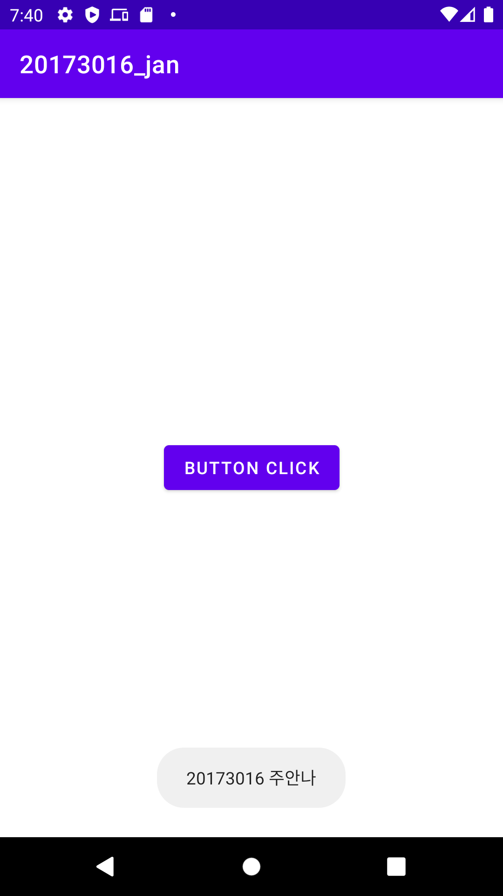
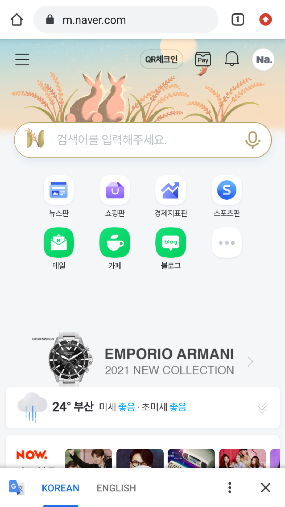
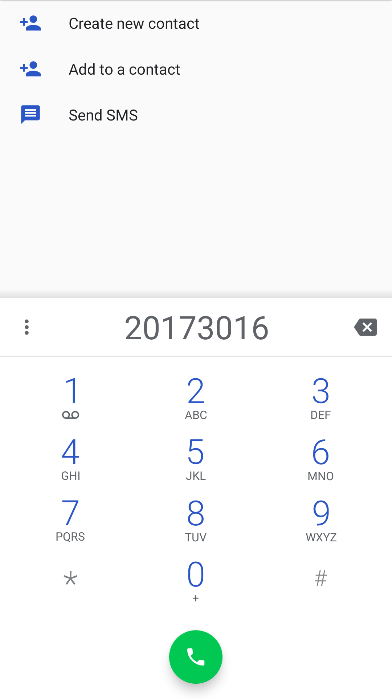
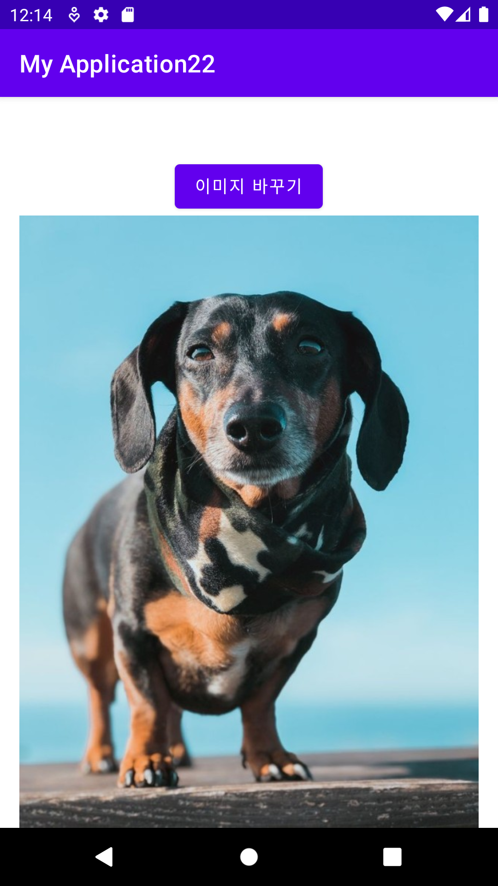
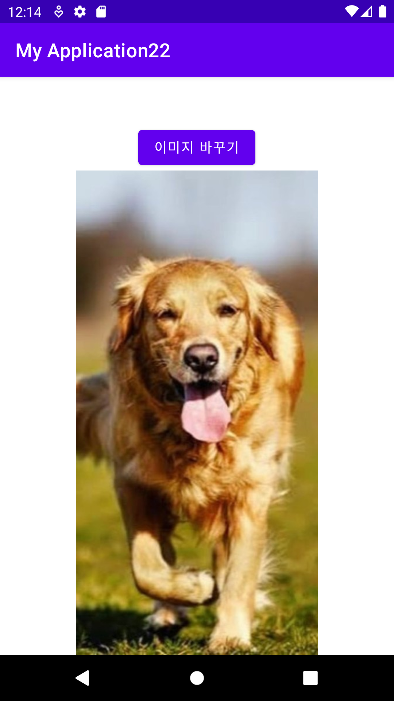

# 20173016_anna-ju
## 2주차 
  - Github 사용법

</img>

## 3주차

</img>

</img>

## 4주차
### 영화 추천 앱 개발 기획
  - 넷플릭스나 왓챠 등 영상 미디어를 볼 수 있는 플랫폼이 많이 생겨나고 다양한 작품들을 감상할 수 있게되었습니다. 볼 수 있는 영상은 많아졌지만 정작 무엇을 봐야할지 고민해야 하는 상황이 생겼고, 기대했던 작품이 기대 이하의 수준이라서 실망하는 현상까지 발생했습니다. 이런 현상을 줄이기 위해 일일이 리뷰를 찾아보지 않고 감상하기 전 선택의 시간을 줄이기 위한 영화/ 드라마 추천 앱을 개발할 계획입니다. 전체적인 구성은 추후에 생각할 예정입니다.      

## 5주차

</img>

</img>

## 6주차
  -앱 실행이 안돼서 일단 소스 코드만 올리겠습니다. 실행되는데로 바로 수정하겠습니다.
  -mainactivity
</img>
</img>

  -activitymain
</img>
</img>
 
